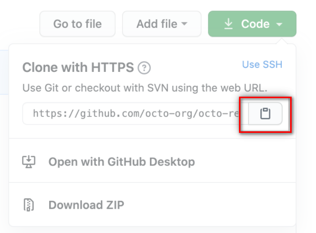
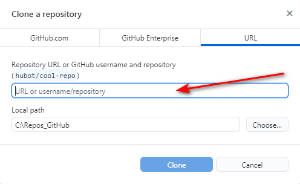

# GitHub Desktop

GitHub (distributed version control system) is a platform where users can host Git repositories. GitHub Desktop allows you to synchronize branches and clone repositories.  It helps you facilitate easy sharing and collaboration on projects with anyone at any time.
GitHub Desktop is a Graphical desktop application which enables adding files and other related git operations.

## How to Install and Configure GitHub Desktop

1. GitHub Desktop can be downloaded from the following link: [Link to GitHub Desktop](	https://desktop.github.com/
) 
3. Click Download for Windows (64bit).
4. Click **Run** and Save file.
5. In the pop-up window, click Install.  
6. In your computer's Downloads folder, double-click GitHub Desktop.
   
     

   
  The following widow appears:  
       
7. In next step create GitHub Pages User Account.   
8. Authorise GitHub Pages  
        
     
For more details see section GitHub Pages. 

## How to create a Local Repository in GitHub
1. Create a folder on your system (C:\Repos_GitHub). This will act as a local repository which will connect the GitHub Pages.
2. In GitHub Desktop open tab File  and create new repository
    

    
4. Commit to Main and Push Origin
    

## How to Clone Repository

1. Go to your GitHub Pages Repository you want to clone.  

2. Click on **Code** on the main page of the repository.
3. To clone the repository under "Clone with HTTPS" click on the follwing icon

    

4. In GitHub Desktop Select File> Clone Repository

5. Paste the URL you copied earlier.

    

6. Press **Clone** to create your local clone.

**Learn more**

[Create repositories](https://training.github.com/downloads/github-git-cheat-sheet/)