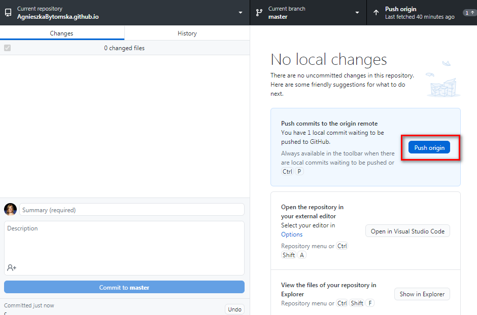
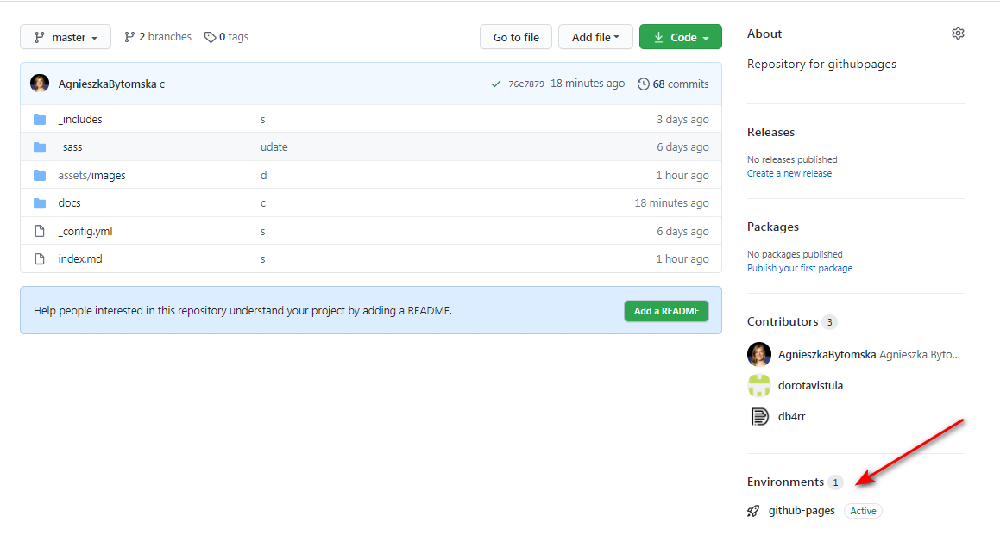
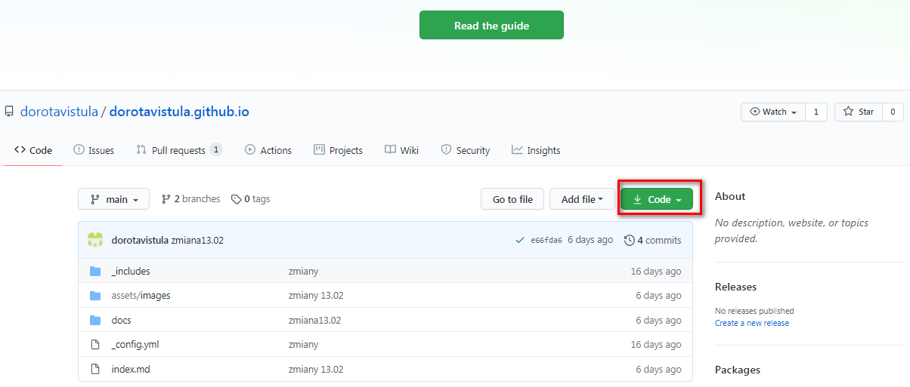
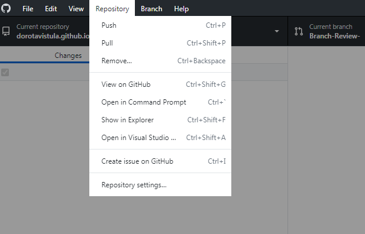

# GitHub Pages 
GitHub Pages are public webpages hosted and easily published through GitHub.

Be familiar with the common functions:

## How to create Account on GitHub Pages
1. Click on link https://github.com/login and create account.

    

2. Verify your e-mail address and click on link. Your account is created. 

     

1. In the upper-right corner of page, click your profile photo to change your profile settings

## How to create Public Repository on GitHub Pages

1. In the upper-right corner of any page select **New repository**.

2. Create a new public repository named *username.github.io*, where username is your username (or organization name) on GitHub.
3. In GitHub Pages cofigure the settings for a new repository eg. private or public view preferences  
      
4. Go to the folder on your system (C:\Repos_GitHub) where you want to store your project, and clone the new repository. Add fileas, commit and push your changes.   
For more information, see : [Creating a repository for your site](https://docs.github.com/en/github/working-with-github-pages/creating-a-github-pages-site)

## How to share your GitHub Repository with your collaborators

To host (or share) a Git repository on GitHub, follow the steps below:

1. Go to your GitHub Repository.

2. Click on Settings tab.

3. Click Manage access.

4. Enter collaborator username

        

5. Invited collaborator receives an e-mail and accept invitation 

    

## How to preview changes via GitHub Pages on web browser
1. After changes done in Markdown, open GitHub Desktop 
2. Preview changes, add comment, press Commit to Master
3. Push to origin   
     
5. Open repository in GitHub Pages 
   
7. Click View Deployment to preview changes in HTML

## How to preview code of your collaborators repository in Visual Studio Code

1. Paste name of your collaborator repository in a browser:  *reposytoryname.github.io*
2. Click Source repository on GitHUb  
     
3. Select Code tab and Open with GitHub Desktop  
   
5. In GitHub Desktop Click Repository tab and chose: Open in Visual Studio
.    

**Learn more**

[Using GitHub](https://paldhous.github.io/ucb/2016/dataviz/week4.html)