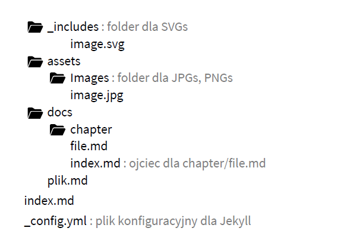
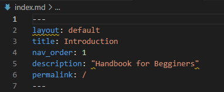

# HTML
HTML is the standard markup language for creating Web pages. For more details see: [HTML Basic](https://www.w3schools.com/html/html_intro.asp)
## How to publish content in HTML format

Structure of repository
   
1. Create index.md in your text editor (eg. Brackets)
2. Save file as new text file. Make sure the file is named ‘index.md’.
3. Add some text.
4. Add the following text to the top of the file. This text tells GiHub to treat this as our home page.
   
   

4. Save the file to your local repository. 
6. Using GitHub Desktop, make a new commit and push your changes to GitHub (our remote repository).
7. Open a browser and go to https://username.github.io.

**Learn more**  
[Vistula Training_PDF](assets/images/../../../assets/images/Vistula_Technologie_Marta+Daniel_13-02-2021.pdf)

