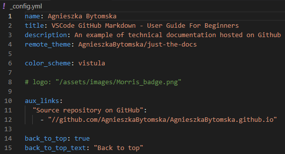

# Jekyll 

GitHub provide some free themes we can apply to our site to add a more professional style. GitHub pages uses Jekyll to create themes and apply them to your site. Jekyll templates can be downloaded from a special repository [Just the Docs](https://pmarsceill.github.io/just-the-docs/).
 
## How to apply a Jekyll theme

1. Choose ‘Create a new file’.
2. Name the file '_config.yml'.
3. Add the folowing text to the file: config file

4. Once we commit this config file, GitHub pages applies the theme to our site. This will give us new options on the layout of our site.

**Learn more**

[Just the Docs](https://pmarsceill.github.io/just-the-docs/docs/customization/)

