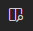

# Markdown basics
Markdown is a text editor which lets you focus on writing and preview a publishing format in HTML. Markdown allows you to write using an easy-to-read, easy-to-write plain text format, that can then be converted into structurally valid HTML.

## How to use Markdown for writing documentation

 Find below the most useful hints in your daily work and link to the basic functions.

 *Tips and tricks for working in Markdown:*
* Commands: Windows Shift + Ctrl + p / Mac Cmd + p, in the <bar
* Preview: Open Preview to the Side 
* Display white space: View> Render Whitespace
* Navigation: Outline / Shift + Ctrl + P @ / breadcrumbs
* Hint: Ctrl + Space
* Suggesting formatting, not words: Shift + Ctrl + P> Preferences: Configure Language Specific Settings> Markdown> "editor.suggest.showWords": false

## Markdown syntax guide

Metadata used to create a well-formatted text file:

* Headers
* Emphasis
* Lists (Ordered & Unordered)
* Images
* Links
* Blockquotes
* Tables
* Blocks of code
* Table of content
  
**Learn more**

 [How to use Markdown for writing technical documentation](https://experienceleague.adobe.com/docs/contributor/contributor-guide/writing-essentials/markdown.html?lang=en)

[Markdown Live Preview](https://markdownlivepreview.com/)

[Guide to Markdown](https://ghost.org/changelog/markdown/)

[Basic Syntax](https://www.markdownguide.org/basic-syntax/)

[Open source online Markdown editor](https://pandao.github.io/editor.md/en.html)
