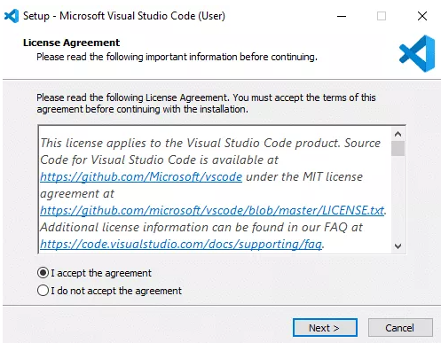
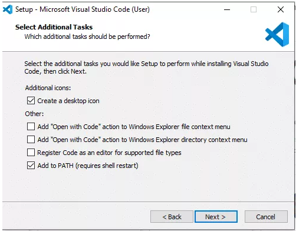
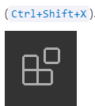

---

layout: default
title: Visual Studio Code
nav_order: 2
has_children: false

---

# Visual Studio Code

Visual Studio Code is a code editor which allows you to quickly find text and replace in the currently opened file. 

## How to Download and Install Visual Studio Code

1. Visual Studio Code can be downloaded from the following link: [Link to Visual Studio Code](https://visualstudio.microsoft.com/downloads/) 
3. Click on the downloaded exe file.
4. Accept the agreement and click on **Next**.
   

   
5. Click Next.
6. Visual Studio will start downloading the initial files. ...
7. In next screen,  click on “create a desktop icon” so that it can be accessed from desktop and click on **Next**.

     

8.  In next screen click **Install** button.
9.  After installation completes, click on the **Finish** button, and the visual studio code will get open.
3.  By default, VS Code installs under C:\users\{username}\AppData\Local\Programs\Microsoft VS Code.

## How to Install Visual Studio Code extensions

You can browse and install extensions within VS Code.
1. Click on the Extension icon in the Activity Bar on the left side ribbon

       

2. In search field paste eg.: **Markdown All In One**
3. The list of the most popular extensions appears
4. Click **Install** button.
   
   **Note:**
   
   To have preview of written content Click Open **Preview to the Side**

**Learn more**

[Documentation for VS Code](https://code.visualstudio.com/docs/getstarted/userinterface)

[Specification](https://daringfireball.net/projects/markdown/)

[Tutorial](https://commonmark.org/help/tutorial/index.html)

[Extensions](https://github.com/mundimark/awesome-markdown )

[About Visual Studio Code](https://github.com/cangulo/meetups/tree/master/vs_code_for_docs/) 

[Multiple Cursors in Visual Studio Code for Windows](https://tahoeninjas.blog/2019/03/30/multi-cursor-editing-in-visual-studio-code/)

