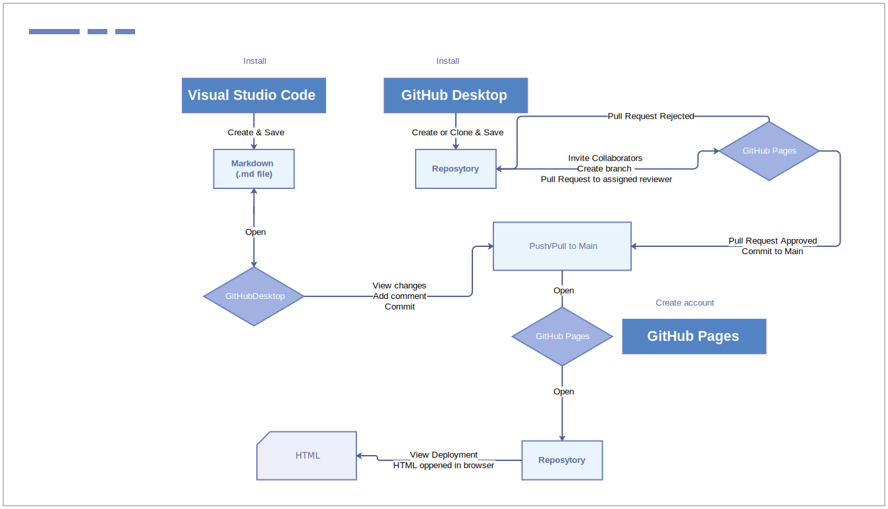

# Introduction

This document provides the user with a comprehensive description of Visual Studio Code Installation and plug-ins set-up to have a preview of content created. The User Guide presents an overview of the Markdown basics functionality dedicated to text formatting.
It lets you become familiar with source code control features and learn how to create a private and public repository in GithHub Pages and how to share it with collaborators.

This manual provides all the information necessary for technical writers to publish content in HTML.

## Read setup instructions and become familiar with:

**Visual Studio Code**

**Markdown**

**GitHub Desktop**

**GitHub Pages**

**Requirements for Installation Visual Studio Code and GitHub Desktop**

| Component | Version |
|:----------|:-----------------|
| Hardware  | 1.6 GHz or faster processor |
|  | 1 GB of RAM |
| Platforms | OS X Yosemite (10.10+)  |
| | Windows 7 (with .NET Framework 4.5.2), 8.0, 8.1 and 10 (32-bit and 64-bit)|
| | Linux (Debian): Ubuntu Desktop 16.04, Debian 9 |
| | Linux (Red Hat): Red Hat Enterprise Linux 7, CentOS 8, Fedora 24|

